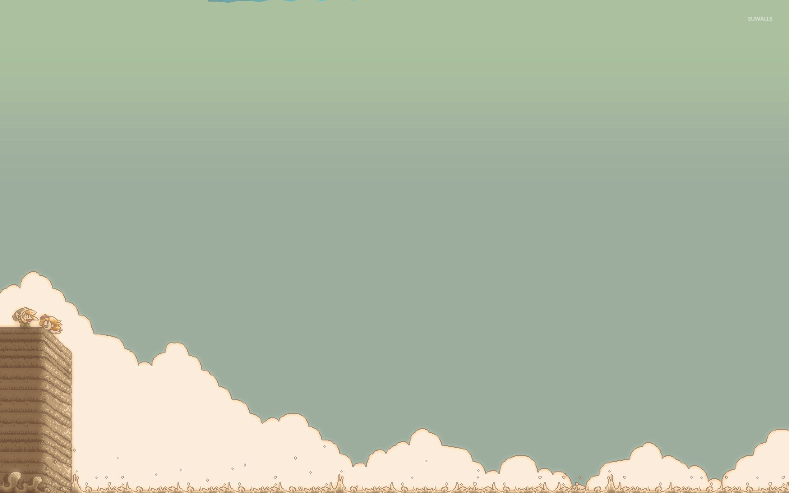

<style> @import url('https://fonts.googleapis.com/css2?family=Press+Start+2P&display=swap'); body { font-family: 'Press Start 2P', cursive; } </style>

<div style="position: relative; text-align: center; color: white;">



<div style="position: absolute; top: 50%; left: 40%; transform: translate(-10%, -80%);">
    <h3>Hello, Renzo here!</h3>
    <small>Frontend Developer | UI Design</small>
    <div style="display: flex; gap: 12px; justify-content: center">
    
    
    
    
    </div>
</div>
</div>

```typescript
const aboutMe = {
  role: "Frontend Developer",
  stack: [
    "Angular",
    "HTML",
    "CSS",
    "Figma",
    "TypeScript",
    "NodeJS",
    ...anythingElse,
  ],
  tools: ["Visual Studio Code", "Git", "Notion"],
  projects: [...githubProjects],
  interests: [
    "Frontend Innovation",
    "Clean Code",
    "Problem Solving",
    "User Interaction",
  ],
};
```
