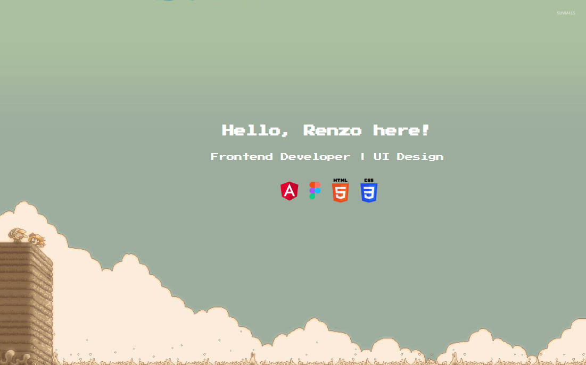

```typescript
const aboutMe = {
  role: "Frontend Developer",
  stack: [
    "Angular",
    "HTML",
    "CSS",
    "Figma",
    "TypeScript",
    "NodeJS",
    ...anythingElse,
  ],
  tools: ["Visual Studio Code", "Git", "Notion"],
  projects: [...githubProjects],
  interests: [
    "Frontend Innovation",
    "Clean Code",
    "Problem Solving",
    "User Interaction",
  ],
};
```
